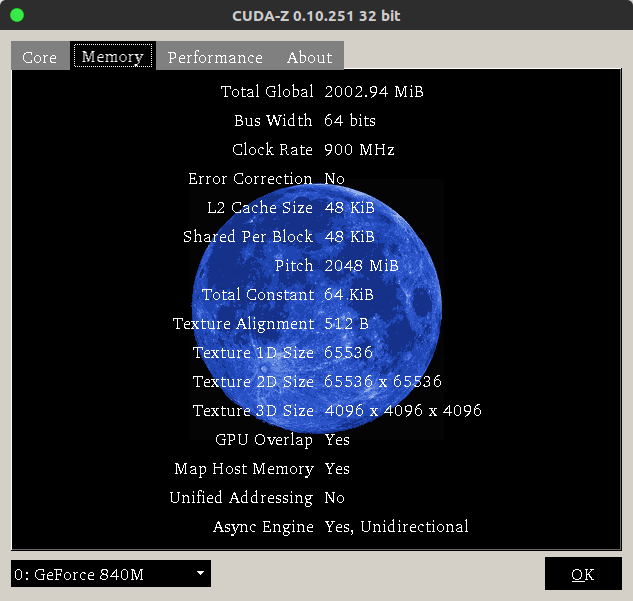
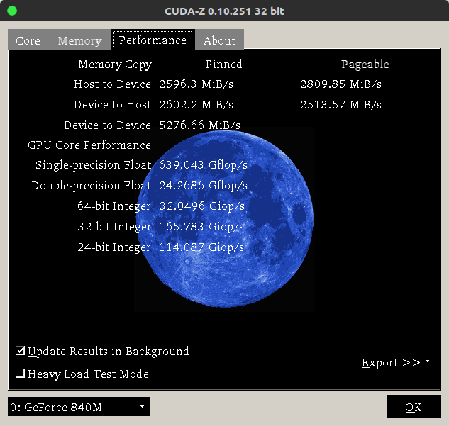

# CUDA 高性能并行计算入门
（UPDATE IN 2018.3.1）

+ ## 概述
	+ **什么是CUDA？**
	CUDA（Compute Unified Device Architecture）是	NVIDIA公司开发的一种计算架构，可以利用NVIDIA系列显卡对一些复杂的计算进行并行加速。

    + **为什么要用CUDA加速？**
    在科学计算领域所要用到的计算往往不是我们熟知的普通矩阵，而是千维甚至万维的矩阵，而普通的CPU串行计算往往不能满足与科学计算所要求的性能。最好的例子就是深度学习，可以说深度学习起源于感知机但正真发展在于计算能力的提高，也就是显卡计算的兴起。深度学习的计算都是基于矩阵的计算，而普通一个识别手写数字的神经网络都有上千个隐含节点，故CUDA性能优化是一门重要的技术。

	+ **为什么显卡可以加速？**
		+ 首先，显卡可以加速最大的原因是其含有上千个CUDA核心，而CPU的核心往往都在各位数，这就决定了显卡可以高度并行的对一些高维度矩阵进行计算。CPU的I/O需要数百上千个周期，串行的计算大部分时间都消耗在I/O上，而显卡则不然，NVIDIA显卡的架构是类似于SIMD架构的SIMT架构，T指的是Threads，也就是单指令多线程架构，上一个线程在进行运算操作时下一个线程就开始I/O操作，类似于指令流水线的形式，当Threads数量足够多时，就可以屏蔽I/O所带来的大量开销，所以本身架构决定了CPU与显卡计算方式的区别。
		+ CPU就好比是一个身强体壮的大汉一下可以挑100公斤粮食，显卡好比是只能挑起10公斤粮食的小矮人，但有20个。现在有2000公斤粮食，I/O相当于需要1分钟时间把粮食装进桶才能挑走（每次只能一个人装桶），运算时间相当于挑一次到目的地需要20分钟。CPU每趟需要21分钟，共20趟，总共需要420分钟。显卡第一趟也需要21分钟，且只能挑10公斤粮食，但第一趟在刚装完桶时，第二个小人就开始装桶了，在第一个小人送完时最后一个小人也装完了桶，接着第一个小人又可以装桶了，所以从共需要2000/10=200个轮回，但每个轮回只需要1分钟，加上最后的小人需要20分钟送完，总计200×1+20=220分钟，比CPU快近一倍的时间。当运算需求越大时，GPU的优势越明显。


+ ## GPU硬件介绍
说了这么多接下去就开始正式入题，想要做CUDA编程就必须先了解自己电脑显卡的硬件，才能针对自己的显卡做必要的优化。当然我指的是NVIDIA系列显卡，Intel和AMD就不要过来捣乱了......

真正进入显卡计算时代的当从Tesla架构开始算起，经历了Fermi，Kapler，到现在的Maxwell，Pascal，一代比一代计算能力强。这里就有人要问了，计算能力强的显卡一定快吗？
错了，NVIDIA官方所说的计算能力指的是单个CUDA核心的架构运算能力，几千个Fermi核心当然可以随随便便秒了几百个的Maxwell核心（同频率下...）。而且这里计算能力并没有把带宽给考虑进去，往往限制CUDA运算速度的不是峰值性能，而是显存带宽。
想要知道自己的硬件明细当然可以用软件的方式直接获取，LINUX系统可以下载CUDA-Z，WINDOWS系统可以下载GPU-Z，MAC土豪请自行寻找软件。
我们以CUDA-Z为例


+ 在Core选项卡中我们可以看到上图所示
(ps:请无视840m垃圾的性能)
**Compute Capability**指的是计算能力：1.x 2.x 3.x 5.x....等等，计算能力越高不光是单个核心的计算能力强，并且可以在CUDA编程的核函数中支持更多的操作。
**Clock Rate**指的是单个核心的运行频率：即我们每个CUDA核心每秒所能操作的次数。相当于CPU的主频。
**Multiprocessors**指的是官方所说的SM数，可以当成许多CUDA核心的集合。
**CUDA Cores**指的是共有多少个计算核心或者说是计算单元：在Kapler架构中，一个SM拥有192个计算单元，而在Maxwell架构中，每个SM只有128个计算单元。所以可以看到840m共有3个SM，有3*128=384个Cores。
**Warp Size**指的是GPU在调度运算时的最小线程数单位！！！非常重要，涉及到优化问题。
**Threads Per Block**指的是每个Block可调度的最大线程数，具体的后面会解释。

+ 然后切换到Memory选项卡

(ps:请再次无视840m垃圾的性能)
**Toltal Global**即显存大小。
**Bus Width**指的是显存位宽，单通道显存32bit，64bit就是双通道。
**Clock Rate**就是显存频率，900Mhz是低压的GDDR3显存，等效频率就是通道数×显存频率，840m等效1800Mhz
**Shared Per Block**是共享内存，请牢记！！！！优化重点。在Maxwell架构中一个SM拥有16KB共享内存，840m有3个SM就是48KB。
**Total Constant**常量内存

+ 最后切换到Performence选项卡

**Host && Device数据交换速率**在编写CUDA程序时尽量少从主存中Copy矩阵到显存，这个操作走的PCI通道，非常的费时间。即使是最新的PCI-E3.0带宽也远远不及显存带宽，所以在编写程序时尽早对数据交换进行。
**Single-precision Float**即单浮点运算性能，639GFlops是每秒可以运行639G次操作，在Maxwell架构中，每个核心具有两个乘加器，即同时可以进行两次乘法和加法操作。


+ ####下面具体介绍硬件架构
	1. **内存结构**
    （盗用中关村的美图，懒得去角标，如若侵权请速与本人联系）
    
    在编写CUDA程序时常用的存储结构：
        + **`__Host__`**修饰符为PC主存，即CPU可调度的内存。
        + **`__Global__`**修饰符为Device内存，也就是显存，显卡可以调度的存储空间。
        + **`__Shared__`**修饰符为Shared内存，共享内存，速度与L2 Cache相同级别，且延迟很低，读取周期很短，但要注意Bank Conflict问题（后面会讲到）。
        + **`__Device__`**修饰符通常用在核函数外，存储在Device内存上，作为全局变量。
        + **`__Constant__`**常量内存。
    数据拷贝时，Shared先从 Host 走 PCI-E 通道拷贝到 Device 上，GPU读取指令后先从L1、L2 Cache中寻找数据地址，若没有再从 Device 上寻找，当然 Device 的读取周期漫长。一般的做法是拷贝到 Shared Memory 上，GPU直接从 Shared Memory 取地址调用数据。

	2. **调度结构**
    在调用kernal函数时总体为一个Grid，Grid中含有Block，一个SM在运行时自动分配调用一些Block，每个Block中有大量的Thread。
    GPU在运算时以一个Warp为单位，即32个Threads为单位，后面我们可以进行验证调度过程。
    Block可以是一维的二维的三维的，Thread也是如此，一般我们选用二维作为调度结构，图中给出来索引的方式。
    
    要注意的是：千万不要让Thread的x和y乘起来大于1024，因为一个block最多只能调度1024个Threads。

+ ##程序性能分析
想要写出一个结合性能和准确率的程序时我们通常需要对这个程序进行性能分析，确保程序可以充分的利用硬件，而不是被内存的存取等原因阻塞计算。
一般CUDA程序分析看两个：
1.**GFlpos**
2.**存取带宽**
每个显卡都具有上述两个瓶颈，可以说是不可逾越的鸿沟，当然显卡越好瓶口越大...
我们首先分析一下我们自己显卡的瓶颈在哪里，当然无视最后我算出的结果，因为真的很低，这个瓶颈性能也可以从各种软件当中获取到。
	+ **GFlops瓶颈**，单浮点数运算峰值性能，刚刚的CUDA-Z已经为我们测算出来了**平均性能**，我们自己手算一遍**峰值性能**：
			840m在默认频率下核心速率为1029MHZ，可以Boosting到1124MHZ（当然不可能一直超频，所以只算默认频率下的计算峰值性能），每颗核心可以同时运行2次乘加，也就是一颗CUDA Core每秒可以运行1029M × 2 = 2058M = 2.058G次乘加，一共有384个CUDA Cores，所以最后每秒可以运行的乘加数为2.058G × 384 = 790.272 GFLOPS。
	+ **内存瓶颈**，即带宽瓶颈，为什么会有这个瓶颈，因为GPU在运算时需要从Device Memory上取操作数，而取数操作非常慢，所以若程序线程可以保持一直并行取数的状态，并将这些数用于计算，则效率会相当高，在GPU-Z中会显示内存带宽大小，这与**显存位宽**和**显存频率**有关，我们也来手动计算一下：
			840m的默认显存颗粒频率为900MHZ，等效工作频率为1800MHZ，一次可以取64Bit大小的数据，我们在计算时一般都利用单浮点数进行计算，单浮点数有4个Byte，每个Byte有8个Bit，也就是一个Float型数为32Bit，也就是840m每次操作可以取2个Float型的数，共8Byte大小，故每秒可以取1800 × 8 = 14400MHZ = 14.4GHZ。Linux系统等效频率可以在NVIDIA X SERVER里面查看。当然里面你也能看到PCI-E及其缓慢的传输速率。


+ ## 在Ubuntu上配置CUDA
建议在Linux上进行编程，因为你的工程可以直接MAKEFILE或者直接命令行进行NVCC编译而不需要像Windows上那样配置在VS201x上。
系统建议用16.04版本，因为这和之前的14.04一样时LTS版本，有着较长的生命周期并且比较稳定，但为什么我不推荐14.04版本，因为现在许多新版本的框架已经不支持老版本Ubuntu系统了。
	+ 第一步要装显卡驱动，Ubuntu相对方便很多。
	打开设置
    
    找到最底下的软件和更新
    打开附加驱动选项卡
    
	选择最新的NVIDIA binary driver，**如果是笔记本带有Inter集成显卡的用户千万千万在选择NVIDIA驱动的同时下面会有Intel的驱动，选择成除默认外的另外一个**，如果你忘了选择Intel驱动就开始安装NVIDIA驱动然后重启的话...嗯...你可能需要重新安装你的Ubuntu系统，别问我怎么知道的，惨痛的亲身经历～
    安装好后会重启电脑，这时Dash中会出现我刚刚所说的NVIDIA X SERVER，当你不用独立显卡时或者外出为了省电时可以在这个软件里面进行热切换显卡，具体的操作在PRIME PROFILES选项卡中。
    

    + 接着要配置CUDA
    这里我们要安装CUDA8.0,为什么不安装9.0？
    因为现在许多深度学习框架对CUDA9.0的支持并不好，所以最稳定最保险就是安装8.0版本，当然如果要进行深度学习开发还需要安装Cudnn等附加包，这里就不再赘述了。
    首先要取NVIDIA官网下载CUDA8.0，选择LINUX-x86_64-Ubuntu-16.04-runfile[local]，也就是本地的run文件。
    
    下载好以后用命令行运行run文件。
    ```bash
    //运行run文件
    sudo sh cuda_8.xx.xx_linux.run
    //编辑环境变量
    sudo gedit /etc/profile
    //在末尾加入以下环境变量
    export PATH=/usr/local/cuda-8.0/bin:$PATH
	export LD_LIBRARY_PATH=/usr/local/cuda-8.0/lib64$LD_LIBRARY_PATH
    ```
	完成以上步骤后重启电脑
    检测自己的CUDA是否配置成功只需ctrl+alt+T打开命令行输入
    ```bash
    nvcc
    ```
    如果跳出来
    
    或者并**没有报错**
    则说明CUDA已经安装完毕
	至此所有提前需要了解的知识已经讲完了，当然我默认读者是掌握了C，C++并有一些编程功底的人，毕竟并行编程要考虑的东西远远比在CPU上写程序来的多的多。

+ ## 额外的程序环境
在这里我推荐直接用Sublime Text进行编写，毕竟看着要比Vim舒服写。而且在编写较长程序时右上角的缩略图滚动是我认为比别的文本编辑器做的都好的地方。

这里有官网下载传送门：[Download Sublime Text](https://www.sublimetext.com/3)

+ ##小试牛刀
终于要开始写第一个CUDA程序了，清空脑袋，开始吧！
创建一个CUDA文件，**CUDA文件的后缀名是.cu**，我们取名叫basic.cu
用sublime text打开。
由于编译器不能认识.cu后缀名，这样语法就不能高亮显示，我们在软件的右下角选择到C++模式。
一个CUDA程序包含两个部分，一个是串行部分，一个时CUDA并行部分，串行部分在CPU上执行，CUDA部分则会拷贝到显卡上执行。
首先我们要引入头文件，这里我们使用Cpp，C，CUDA混编模式，所以需要引入三个头文件：
```cpp
#include <stdio.h>
#include <iostream>
#include <cuda_runtime.h>
using namespace std;
```
其中cuda_runtime.h是cuda函数所在的声明文件
**接下来我们要完成的任务是：将一个矩阵输入到Global内存中，利用GPU全部加1后返回到Host内存进行输出。**
第一步是需要在CPU中创建一个矩阵，我们一般使用一维动态数组开辟，用二维的方式进行索引。
先利用Malloc函数在CPU上开辟一块空间，并全部赋值为1。
```cpp
int size = 5;
float *a = (float*)malloc(sizeof(float)*size*size);
for (int i = 0; i < size; i++) {
    for (int j = 0; j < size; j++) {
        a[i*size+j] = 1.0f;
    }
}
```
然后需要在GPU上同样开辟一个相同大小的空间以存放矩阵，这里使用cudaMalloc函数。
```cpp
float *a_cuda;
cudaMalloc((void**)&a_cuda,sizeof(float)*size*size);
```
接着，我们将矩阵从CPU上copy到GPU上。
```cpp
cudaMemcpy(a_cuda,a,sizeof(float)*size*size,cudaMemcpyHostToDevice);
```
这时的a_cuda指向的是GPU上Device Memory上的一块地址。
那GPU要如何才能运行这一块内存中的数据呢？
对，没错，就是使用核函数，也叫作Kernel函数。
核函数的使用语法如下：
```cpp
Function<<<griddim,blockdim,extern shared memory,GPU stream>>>(param...);
```
中间的参数可以控制核函数运行所占用的资源。
griddim表示调用的block块数
blockdim表示调用的thread数
后面两个参数分别表示动态定义共享内存大小和可使用的SM处理器数。
那说到这里，如何定义kernel呢？
kernal函数用`__global__`修饰符来修饰
下面我们就来定义一个矩阵每个元素都加 1 的kernel函数
在定义核函数之前先要考虑好需要调用多少block和thread，这里时5×5的矩阵，我们可以使用1个block和25个thread排列为5×5thread阵列。
核函数定义如下：
```cpp
__global__ void addone(float *a) {  
    int tix = threadIdx.x;
    int tiy = threadIdx.y;
    int bdx = blockDim.x;
    int bdy = blockDim.y;
    a[tix*bdy+tiy] += 1;
}
```
其中threadIdx和blockDim是CUDA的内建变量，指示这当前正在调度的线程号和线程的数量。
每个线程都会调用一次，故只需要将a矩阵对应位置的数值+1即可。
接着在主函数中调用核函数。
```cpp
dim3 grid(1, 1, 1), block(5, 5, 1);
addone<<<grid,block>>>(a_cuda);
```
dim3是一个CUDA内建的变量，是一个三维指示变量，分别对应这x，y，z三维，利用这个变量我们可以控制程序所调用的block和thread总量。
由于没有用到动态的shared memory也不去控制调用的SM核心数，所以后面两个参数保持默认值。
最后将运行完成的a_cuda拷贝到Host内存中。
```cpp
cudaMemcpy(a,a_cuda,sizeof(float)*size*size,cudaMemcpyDeviceToHost);
```
为了矩阵输出的方便，自己写一个矩阵打印函数。
```cpp
void MatrixPrint(float *mat, int rows, int cols) {
    for (int i = 0; i < rows; i++) {
        for (int j = 0; j < cols; j++) {
            cout << setw(2) << mat[i*cols+j] << " ";
        }
        cout << endl;
    }
    cout << endl;
}
```
这些也需要对应的格式化输出头文件
```cpp
#include <iomanip>
```
到这里就完成了整个CUDA程序的编写。
看一下整体代码：

```cpp
#include <stdio.h>
#include <iostream>
#include <iomanip>
#include <cuda_runtime.h>
using namespace std;

void MatrixPrint(float *mat, int rows, int cols) {
    for (int i = 0; i < rows; i++) {
        for (int j = 0; j < cols; j++) {
            cout << setw(2) << mat[i*cols+j] << " ";
        }
        cout << endl;
    }
    cout << endl;
}

__global__ void addone(float *a) {
    int tix = threadIdx.x;
    int tiy = threadIdx.y;
    int bdx = blockDim.x;
    int bdy = blockDim.y;
    a[tix*bdy+tiy] += 1;
}
int main()
{
	int size = 5;
	float *a = (float*)malloc(sizeof(float)*size*size);
	for (int i = 0; i < size; i++) {
		for (int j = 0; j < size; j++) {
			a[i*size+j] = 1.0f;
		}
	}
	MatrixPrint(a,size,size);
	float *a_cuda;
	cudaMalloc((void**)&a_cuda,sizeof(float)*size*size);
    cudaMemcpy(a_cuda,a,sizeof(float)*size*size,cudaMemcpyHostToDevice);

    dim3 grid(1, 1, 1), block(5, 5, 1);
    addone<<<grid,block>>>(a_cuda);
    cudaMemcpy(a,a_cuda,sizeof(float)*size*size,cudaMemcpyDeviceToHost);
    MatrixPrint(a,size,size);
    return 0;
}
```
**那要如何运行这个程序呢？？？**
将命令行cd到.cu文件所在目录，利用nvcc编译器进行编译，当然你要知道你的显卡计算能力时多少。
整体编译语句风格与GCC类似：
```bash
nvcc -gencode=arch=compute_50,code=\"sm_50,compute_50\" -o basic basic.cu
```
-gencode表示为计算能力xx而生成程序
如果跳出的只有warning而没有error的话说明程序通过编译，可以执行。
```bash
./basic
```
直接执行即可

发现在CUDA运行下已经将矩阵元素从1变为2。

* ## 进阶之路
基本的语法相信读者已经初步掌握了，接下去就要对计算性能提出更高的要求。
之后的所有优化我们都围绕着矩阵相乘来做，最后会对比CUBALS性能，CUBLAS是NVIDIA用其不开源的编译器编译出来的线性代数库，汇编编写的底层，运行速度飞一般的快......但是，没有关系，经过我们的优化可以在一定范围内超越CUBLAS的运行的速度。

* #### 矩阵相乘（第“3的0次方”讲）
大矩阵相乘是一个经典的可并行化的问题，也是一个在科学计算领域用的最多的一个算法。
首先我们要捋清楚思路，矩阵是如何相乘的。

公式是这样的，然而看起来还是不够明了

这样看起来就舒服多了
假如你还是没有看懂或者忘了的话，线性代数知识可能需要好好回顾了。
那么，我们需要先定义CPU代码，看看CPU是如何完成矩阵相乘的，当然这对于大多数程序员来说不过几行代码的问题，非常简单，在这里我们直接将其封装成函数：
```cpp
void MatrixMul_host(float *a, int a_rows, int a_cols, float *b, int b_rows, int b_cols, float *c) {
    for (int i = 0; i < a_rows; i++) {
        for (int j = 0; j < b_cols; j++) {
            float t = 0;
            for (int k = 0; k < b_rows; k++) {
                t += a[i*a_cols+k]*b[k*b_cols+j];
            }
            c[i*b_cols+j] = t;
        }
    }
}
```
相信大家都可以看懂的～～～
当然想要运行这个函数还需要申请空间然后对矩阵赋值...and so on
我们也封装一些这样的函数，简便起见我们将所有的矩阵都赋值为-1和1两个值。
先是矩阵生成函数
```cpp
void MatrixRandBin(float *mat, int rows, int cols) {
    for (int i = 0; i < rows; i++) {
        for (int j = 0; j < cols; j++) {
            if ((float)rand()/RAND_MAX > 0.5) {
                mat[i*cols+j] = 1.0f;
            }else {
                mat[i*cols+j] = -1.0f;
            }
        }
    }
}
```
然后是矩阵的比较函数，用于比较GPU最后跑出来的结果和CPU跑出来的是否一致，也就是验证正确性，这相当重要，不能优化着优化着把结果搞错了。
```cpp
float MatrixCompare(float *a,float *b,int rows,int cols){
    float err=0;
    for (int i=0;i<rows;i++){
        for (int j=0;j<cols;j++){
            err+=abs(a[i*cols+j]-b[i*cols+j]);  
        }
    }
    return err;
}
```
到这里为止，我们的辅助函数就定义完成了，接下去开始实现GPU版的矩阵相乘。
在写所有程序之前都应该想清楚程序如何运行，线程如何调度。
+ 让人一想就能想到的算法是，既然有block，既然有thread，那么每个block负责1行的计算，每个thread负责几列的计算应该是比较好的。
|thread1|thread2|thread3|......|thread1|thread2|......|
|----|----|-----|-------|-----|-----|----|
|block2|
|block3|
|block4|
|......|
|block100|
|block101|
|......|
这时如何写这个kernel函数呢？
Device Memory有一个特点，连续读取的速度远远高于随机读取的速度，那什么叫连续读取，这里就涉及到线程的调度问题。单个线程连续读取一块内存算是连续读取吗？错了，在GPU执行时，是一个线程读取完一组数据后直接调用下一个线程读取，而非一个线程连续读取，所以按照线程号排列的索引才是连续的索引。具体操作看kernel函数：
```cpp
__global__ void MatrixMul_device(float *a, int a_rows, int a_cols, float *b, int b_rows, int b_cols, float *c) {
	int tix = threadIdx.x;
	int tiy = threadIdx.y;
    int bix = blockIdx.x;
    int biy = blockIdx.y;
    int bdx = blockDim.x;
    int bdy = blockDim.y;
    int gdx = gridDim.x;
    int gdy = gridDim.y;

    for (int i = tix; i < b_cols; i += bdx) {
        float sum = 0;
        for (int k = 0; k < a_cols; k++) {
            sum += a[bix*a_rows+k]*b[k*b_cols+i];
        }
        c[bix*a_cols+i] = sum;
    }
}
```
这个算法看上去非常的简洁，然后我们同样的先要在CPU上开辟空间，用1000×1000的矩阵相乘来做实验比较好，因为太大了CPU的验证函数真的跑不动==
然后也是同样的拷贝到Device Memory上
```cpp
int Matrixsize=1000;
float *a_host;
float *a_device;
float *b_host;
float *b_device;
float *result_host;
float *result_device;
float *result_cpu;
a_host = (float*) malloc(sizeof(float) * Matrixsize * Matrixsize);
b_host = (float*) malloc(sizeof(float) * Matrixsize * Matrixsize);
result_host = (float*) malloc(sizeof(float) * Matrixsize * Matrixsize);
result_cpu = (float*) malloc(sizeof(float) * Matrixsize * Matrixsize);
srand(0);
MatrixRandBin(a_host,Matrixsize,Matrixsize);
MatrixRandBin(b_host,Matrixsize,Matrixsize);
cudaMalloc((void**)&a_device,sizeof(float) *Matrixsize * Matrixsize);
cudaMalloc((void**)&b_device,sizeof(float) *Matrixsize * Matrixsize);
cudaMalloc((void**)&result_device,sizeof(float) *Matrixsize * Matrixsize);
cudaMemcpy(a_device,a_host,sizeof(float) *Matrixsize * Matrixsize,cudaMemcpyHostToDevice);
cudaMemcpy(b_device,b_host,sizeof(float) *Matrixsize * Matrixsize,cudaMemcpyHostToDevice);
```
result_device用来存储矩阵相乘后的GPU结果，所以也需要在GPU上开辟一段空间。
接着调用kernel函数
```cpp
cudaEvent_t start_device, stop_device;
float time_device;
cudaEventCreate(&start_device);
cudaEventCreate(&stop_device);
cudaEventRecord( start_device, 0 );
dim3 gridsize(1000,1,1);
dim3 blocksize(256,1,1);
MatrixMul_device<<<gridsize,blocksize>>>(a_device,Matrixsize,Matrixsize,b_device,Matrixsize,Matrixsize,result_device);
cudaEventRecord( stop_device, 0 );
cudaEventSynchronize( stop_device );
cudaEventElapsedTime( &time_device, start_device, stop_device );
cudaEventDestroy( start_device );
cudaEventDestroy( stop_device );
cout<<"gputime="<<time_device<<"ms"<<endl;
```
上下两个代码段包围的都是用来测试GPU计算所用的时间的。
因为有1000行，所以需要调用1000个block，thread的调用是有技巧的，读者可以试试不同的值带来的影响。第一点，设置thread最好在32的倍数，因为GPU是以warp作为调度单位，设置33这种，实际还是要调用2个warp，实则浪费了31个线程的计算能力。第二点，thread并不是开的越多越好，thread少，则程序并行度不够，运算时没有其他的warp进行I/O操作。thread多了，每个SM中寄存器数量有限，thread越多，所能够并行的block就越少，最后还是会导致程序运行缓慢，达不到带宽瓶颈。
将运行的结果copy到Host中
```cpp
cudaMemcpy(result_host, result_device,sizeof(float) *Matrixsize * Matrixsize,cudaMemcpyDeviceToHost);
cudaFree(a_device);
cudaFree(b_device);
cudaFree(result_device);
clock_t start_host = clock();
MatrixMul_host(a_host,Matrixsize,Matrixsize,b_host,Matrixsize,Matrixsize,result_cpu);
cout<<"cputime="<<(double)(clock() - start_host)/1000<<"ms"<<endl;
float err=MatrixCompare(result_cpu,result_host,Matrixsize,Matrixsize);
cout<<"err in gpu and cpu = "<<err<<endl;
```
最后运行一下整个程序：

可以看到，比CPU快了25倍！！！
让我们来计算一下他的内存使用带宽：
一共1000行×1000列×中间1000次乘加×每次乘加需要取2个float型数据×每个float4个Byte=8GB数据
8GB数据/用了0.2秒=40GB/S带宽。。。。。
？？？？？？？？？？？？？？？？？？？？？？？？？？？？
840m峰值带宽只有14.4GB/S，怎么会算出来40GB/S呢，难道哪里有问题？？
其实这么算并没有错，但是在计算时并没有考虑到一个问题，就是GPU自动会将一些重复使用度高的数据缓存到L1、L2 cache中，而缓存到cache中所需要的带宽几乎可以忽略，所以在这个过程中所需要在Device Memory读取的数据远远小于8GB。
如何让其GPU可以更好的利用CACHE呢？最简单的做法就是不要频繁的对缓存的数据进行交换，并且尽可能一次让其多读取几次，怎么来实现？只需要减少thread数量就可以了，但是也是在保证并行运行的基础上，由于调用了1000个block，似乎不必太关心并行度，这时我们将thread数减少到32再运行：

OMGGGGGGGG!!!!
比上一个版本快了将近3倍～～～～～～～
当然这只是在这样简单的程序上，GPU对程序的自主优化，但是我们有没有想过自己来对这些进行优化呢？L1 Cache毕竟是有限的，还有和L1 Cache速度相仿的shared Memory 没有用呢。当然，这些我们提到后面再说，接下来一讲要说明Device Memory的对齐读取。

* #### 矩阵相乘（第“In(e的2次方)”讲）
在上一个版本的程序中，对GPU的Cache优化和Device Memory的连续存取有了初步的了解，但是GPU对Device Memory还有一个特点，GPU对它是按照内存对齐读取的，在Compute Capability 5.0中，内存按照128个float进行对齐，比如说读取第（0，513）元素时候可以从0的地址开始读取512个地址，只需要少量寻址就可以了，但是在读取（1,513）时候还能这么读取吗？
1000×1000的矩阵，第二行是1001个元素，已经不是和128对齐了，故GPU不能用PITCH方式进行读取，而还是从0地址开始读取，读取1000×1+512个元素才能寻址到，若是读取最后一个则需要将整个矩阵元素全部寻址才能读取，所以内存对齐非常重要。若是每一行都与128的倍数对齐的话，CPU就可以按照PITCH读取，也就是读（1,513）时只需要从第二行开头开始读取，读取512个元素即可，若是读取最后一个元素，只需要用1000次索引到最后一行的开头，然后再索引全部最后一行即可，时间复杂读从o(m*n)变成了o(m+n)。
怎么对齐呢？
可以手动对齐，也就是（（1000-1）/128+1）× 128 = 1024。也就是需要开辟1000×1024的矩阵才能对齐内存，难道每次开辟时候还需要这么麻烦的计算？
当然NVIDIA已经为我们考虑好了，内存对齐后的一行成为一个Pitch，利用cudaMallocPitch函数，CUDA会为我们自动分配Pitch不需要自己手动计算。在copy显存时需要用cudaMemcpy2D函数，这个函数会自动匹配Pitch来进行copy。此时内存拷贝变成如下：
```cpp
size_t pitch_a_device, pitch_b_device, pitch_result_device;
cudaMallocPitch((void**)&a_device , &pitch_a_device , sizeof(float) *Matrixsize , Matrixsize);
cudaMallocPitch((void**)&b_device , &pitch_b_device , sizeof(float) *Matrixsize , Matrixsize);
cudaMallocPitch((void**)&result_device , &pitch_result_device , sizeof(float) *Matrixsize , Matrixsize);
cudaMemcpy2D(a_device,pitch_a_device,a_host,sizeof(float) *Matrixsize ,sizeof(float) *Matrixsize, Matrixsize,cudaMemcpyHostToDevice);
cudaMemcpy2D(b_device,pitch_b_device,b_host,sizeof(float) *Matrixsize ,sizeof(float) *Matrixsize, Matrixsize,cudaMemcpyHostToDevice);
```
这些size_t就是以Byte为单位的Pitch长度。如果要转换为float型多大空间则需要/sizeof(float)来得到。
拷贝到Host的函数是
```cpp
cudaMemcpy2D(result_host,sizeof(float) *Matrixsize, result_device,pitch_result_device,sizeof(float) *Matrixsize , Matrixsize,cudaMemcpyDeviceToHost);
```
kernal函数的索引需要做出改变
```cpp
__global__ void MatrixMul_device(float *a,int a_pitch,int a_rows,int a_cols,float *b,int b_pitch,int b_rows,int b_cols,float *c,int c_pitch){
	int tix=threadIdx.x;
	int tiy=threadIdx.y;
    int bix=blockIdx.x;
    int biy=blockIdx.y;
    int bdx=blockDim.x;
    int bdy=blockDim.y;
    int gdx=gridDim.x;
    int gdy=gridDim.y;
    int i,k;
    for(i=tix;i<b_cols;i+=bdx){
        float sum=0;
        for(k=0;k<a_cols;k++){
            sum+=a[bix*a_pitch+k]*b[k*b_pitch+i];
        }
        c[bix*a_pitch+i]=sum;
    }
}
```
用picth来作为索引的列宽。
调用核函数也需要做出改变。
```cpp
MatrixMul_device<<<gridsize,blocksize>>>(a_device,pitch_a_device/sizeof(float),Matrixsize,Matrixsize,b_device,pitch_b_device/sizeof(float),Matrixsize,Matrixsize,result_device,pitch_result_device/sizeof(float));
```
同样的用nvcc编译一下.cu文件。
看一下结果。

又减少了1/5的时间，由于Cache缓存了整个操作，实际在Device Memory上进行操作非常少，所以看起来提升不明显，其实整个操作可以带来大约3倍带宽的提升。

* #### 矩阵相乘（第“(int)(100/33)”讲）
这一讲我们将调用类似于L1 Cache速度的shared memory来手动缓存一些操作，来更多的挖掘整个显卡的计算能力。
在用shared memory时我们的目标是将重复计算缓存到shared memory中，因为本身缓存操作也是一种读取操作，如果没有大量的重复调用这些地址则带来的提升收效甚微。
在这种方式操作的矩阵相乘中，A每一个行的都需要与B的每一列进行对应相乘，每次都需要读取A所操作的一行，在这之中就有大量的重复读取，若能将A所乘的一行读取到shared memory中，就可以减少大量的带宽占用。
再次改变核函数内部：
```cpp
__shared__ float a_shared[1000];
for(int j=tix;j<a_cols;j+=bdx){
    a_shared[j]=a[bix*a_pitch+j];
}
__syncthreads();
int i,k;
for(i=tix;i<b_cols;i+=bdx){
    float sum=0;
    for(k=0;k<a_cols;k++){
        sum+=a_shared[k]*b[k*b_pitch+i];
    }
    c[bix*a_pitch+i]=sum;
}
```
首先申请1000空间的shared memory，用`__shared__`修饰。
然后利用线程将所需要操作的空间copy进去，此时需要同步线程时间才能进入下一步操作，因为线程在这一步操作与下一步操作无关，下一步的操作读取必须实在shared memory读取完成后的，所以需要用`__syncthreads()`同步block内线程，当这个block内所有线程都完成copy操作后再进行乘法操作即可。
这一版本的程序需要多少时间花费呢？

又减少了不少的时间，这时L1缓存的作用减少了许多，因为我们已经把大部分重复操作都读进共享内存中，可以看出我们自己写的内存优化操作其实要比GPU自动进行的好，当然也是由于L1、L2的原因，并不能直接计算带宽，实际上，这个操作可以带来大约2-5倍的带宽节省，节省非常的大。此时已经比cpu快了100倍。当然还可以更快速。
这三讲把矩阵相乘优化了，但是在优化内存时也仅仅把A部分的矩阵缓存至shared memory，B矩阵部分并没有过多的优化，可以借助分块矩阵算法进行优化，这个会在以后讲到，下一讲将针对一个比较有用的矩阵进行特殊的优化。

* #### 矩阵相乘（第“2×(最小自然数+2)”讲）
除了利用分块矩阵算法将B矩阵也缓存进shared memory似乎就没有其他可以对内存带宽带来收益的操作了。所以程序的解决必须开拓思维，分析整个程序的核心部分。矩阵乘法的核心部分就是A的行和B的列对应相乘部分，这部分如何可以减少时间呢？
在深度学习中，几乎都用的单浮点型矩阵相乘，而如果矩阵只有1与-1值呢？我们称为二进制矩阵，用其进行的操作必然会带来精度的降低，但是如果用单浮点矩阵在需要实时运算的且设备能力较低的嵌入式中使用大型矩阵相乘操作，无疑会带来
1. 显存空间
2. 计算耗时

	这些问题，用二进制矩阵来代替现有的矩阵框架，怎么相乘？1和-1相乘为-1不就相当于1与0进行XNOR操作吗？这时矩阵只需要占用1位进行存储，显存空间减少32倍，也就是利用int型可以存下32个数字，并且只需要1步同或操作就可以完成32个数字的乘法操作，相当迅捷，这就为我们接下来的优化提供了思路。
第一步还是先捋清整个算法的思路：
1.申请内存空间
2.copy到显存
3.A按行，B按列，每32个数字利用二进制表示存储成int型
4.A与B相乘，把乘法操作转化为同或操作
5.统计异或结果的和时利用popcount算法
6.得到结果，返回Host
7.比较结果
开始一步步实现：
我们先利用之前不用shared memory版本的程序框架来实现。
先申请内存空间并copy到显存：

```cpp
int Matrixsize=1000;
float *a_host;
float *b_host;
float *result_host;
a_host = (float*) malloc(sizeof(float) * Matrixsize * Matrixsize);
b_host = (float*) malloc(sizeof(float) * Matrixsize * Matrixsize);
result_host = (float*) malloc(sizeof(float) * Matrixsize * Matrixsize);
srand(0);
MatrixRandBin(a_host,Matrixsize,Matrixsize);
MatrixRandBin(b_host,Matrixsize,Matrixsize);
// cout<<MatrixCopysize<<endl;

float *a_device;
float *b_device;
float *result_device;
cudaMalloc((void**)&a_device,sizeof(float) *Matrixsize * Matrixsize);
cudaMalloc((void**)&b_device,sizeof(float) *Matrixsize * Matrixsize);
cudaMalloc((void**)&result_device,sizeof(float) *Matrixsize * Matrixsize);
cudaMemcpy(a_device,a_host,sizeof(float) *Matrixsize * Matrixsize,cudaMemcpyHostToDevice);
cudaMemcpy(b_device,b_host,sizeof(float) *Matrixsize * Matrixsize,cudaMemcpyHostToDevice);
```
建立一个函数封装整个操作：
```cpp
void MatrixMul_device(float *a,float *b,int a_rows,int a_cols,int b_cols,float *result){}
```
第一个要实现的就是将普通矩阵A和B按32位转换成int型。
先是开始的准备阶段，进行pitch对齐，由于需要32位转换一次，所以A的每一行（B中每一列）也必须是32的倍数，空余的进行0填充，如何进行0填充？
比较好的思路就是先申请一块32倍数对齐的空间，然后全部置零，再将原矩阵copy进去。
```cpp
int BINSIZE=32;//size of bin2int, 32 means 0000 0000 0000 0000 0000 0000 0000 0000
int MaxBS=(a_cols-1)/BINSIZE+1;
int a_cols_Copysize=MaxBS*BINSIZE;
float *a_device;//a_rows * a_cols_Copysize
float *b_device;//a_cols_Copysize * b_cols
size_t pitch_a_device, pitch_b_device;
cudaMallocPitch((void**)&a_device , &pitch_a_device , sizeof(float) *a_cols_Copysize , a_rows);
cudaMallocPitch((void**)&b_device , &pitch_b_device , sizeof(float) *b_cols , a_cols_Copysize);

cudaMemset(a_device, 0, pitch_a_device * a_rows);
cudaMemset(b_device, 0, pitch_b_device * a_cols_Copysize);
cudaMemcpy2D(a_device,pitch_a_device,a,sizeof(float) *a_cols ,sizeof(float) *a_cols, a_rows,cudaMemcpyDeviceToDevice);
cudaMemcpy2D(b_device,pitch_b_device,b,sizeof(float) *b_cols ,sizeof(float) *b_cols, a_cols,cudaMemcpyDeviceToDevice);

int *a_device_bin;
int *b_device_bin;
size_t pitch_a_device_bin, pitch_b_device_bin;
cudaMallocPitch((void**)&a_device_bin , &pitch_a_device_bin , sizeof(int) *MaxBS , a_rows);
cudaMallocPitch((void**)&b_device_bin , &pitch_b_device_bin , sizeof(int) *b_cols , MaxBS);
```
然后就是转换操作，由于A，B矩阵的转换不同，故需要写两个函数。
```cpp
//horizontal
__global__ void AMatrix2Bin(float *a,int *a_bin,int a_rows,int pitch_a,int pitch_a_bin,int MaxBS,int BINSIZE){
    int tix=threadIdx.x;
    // int tiy=threadIdx.y;
    int bix=blockIdx.x;
    // int biy=blockIdx.y;
    int bdx=blockDim.x;
    // int bdy=blockDim.y;
    int gdx=gridDim.x;
    // int gdy=gridDim.y;


    int maxThreads=MaxBS*a_rows;
    for(int id = bix*bdx+tix; id < maxThreads; id+=gdx*bdx) {
        int rid=id/MaxBS;
        int cid=id%MaxBS;

        int Integer=0;
        int base=1;
        for (int i=0;i<BINSIZE;i++){
            if (a[rid*pitch_a+(cid+1)*BINSIZE-1-i]==1.f){
                Integer+=base;
            }
            base=base<<1;
        }

        a_bin[rid*pitch_a_bin+cid]=Integer;
    }

}
//vetical
__global__ void BMatrix2Bin(float *b,int *b_bin,int b_cols,int pitch_b,int pitch_b_bin,int MaxBS,int BINSIZE){
    int tix=threadIdx.x;
    // int tiy=threadIdx.y;
    int bix=blockIdx.x;
    // int biy=blockIdx.y;
    int bdx=blockDim.x;
    // int bdy=blockDim.y;
    int gdx=gridDim.x;
    // int gdy=gridDim.y;

    int maxThreads=MaxBS*b_cols;
    for(int id = bix*bdx+tix; id < maxThreads; id+=gdx*bdx) {
        int cid=id/MaxBS;
        int rid=id%MaxBS;

        int Integer=0;
        int base=1;
        for (int i=0;i<BINSIZE;i++){
            if (b[((rid+1)*BINSIZE-1-i)*pitch_b+cid]==1.f){
                Integer+=base;
            }
            base=base<<1;
        }

        b_bin[rid*pitch_b_bin+cid]=Integer;
    }

}
```
其中有一个小技巧，就是利用`>>`左移符号，左移一位相当乘2,当然这样操作会比直接利用浮点型计算要快。
这个函数并不需要多少时间运行，时间复杂度并不高，且内存读取次数也非常少，故不将其计入总运行时间。
调用两个函数。
```cpp
AMatrix2Bin<<<GS_BIN,BS_BIN>>>(a_device , a_device_bin , a_rows ,
    pitch_a_device/sizeof(float) , pitch_a_device_bin/sizeof(int) , MaxBS , BINSIZE);
BMatrix2Bin<<<GS_BIN,BS_BIN>>>(b_device , b_device_bin , b_cols ,
    pitch_b_device/sizeof(float) , pitch_b_device_bin/sizeof(int) , MaxBS , BINSIZE);
```
接着就是写主kernel函数，当然需要先准备popcount函数，popcount函数版本非常多，本人采用利用存储空间来换取性能的popcount函数，先将256个计数位放到Device memory中，这里需要用到`cudaMemcpyToSymbol（）`函数，这个函数可以用来copy全局内存和常量内存等。然后在Device memory上建立一个kernel可调用的popcount函数。
申明全局变量和函数：
```cpp
__device__ unsigned char __popcount_tab_device[256];//__constant__ is slower than __device__
__device__ int popcount (int x) {
  return __popcount_tab_device[(x >>  0) & 0xff]  
  + __popcount_tab_device[(x >>  8) & 0xff]  
  + __popcount_tab_device[(x >> 16) & 0xff] 
  + __popcount_tab_device[(x >> 24) & 0xff];
}
```
拷贝计数位：
```cpp
const unsigned char __popcount_tab[] = {
  0,1,1,2,1,2,2,3,1,2,2,3,2,3,3,4,1,2,2,3,2,3,3,4,2,3,3,4,3,4,4,5,
  1,2,2,3,2,3,3,4,2,3,3,4,3,4,4,5,2,3,3,4,3,4,4,5,3,4,4,5,4,5,5,6,
  1,2,2,3,2,3,3,4,2,3,3,4,3,4,4,5,2,3,3,4,3,4,4,5,3,4,4,5,4,5,5,6,
  2,3,3,4,3,4,4,5,3,4,4,5,4,5,5,6,3,4,4,5,4,5,5,6,4,5,5,6,5,6,6,7,
  1,2,2,3,2,3,3,4,2,3,3,4,3,4,4,5,2,3,3,4,3,4,4,5,3,4,4,5,4,5,5,6,
  2,3,3,4,3,4,4,5,3,4,4,5,4,5,5,6,3,4,4,5,4,5,5,6,4,5,5,6,5,6,6,7,
  2,3,3,4,3,4,4,5,3,4,4,5,4,5,5,6,3,4,4,5,4,5,5,6,4,5,5,6,5,6,6,7,
  3,4,4,5,4,5,5,6,4,5,5,6,5,6,6,7,4,5,5,6,5,6,6,7,5,6,6,7,6,7,7,8,
};
cudaMemcpyToSymbol(__popcount_tab_device, __popcount_tab, sizeof(__popcount_tab));
```
调用主kernel的准备工作，建立结果容器：
```cpp
float *result_device;//a_rows * b_cols
size_t pitch_result_device;
cudaMallocPitch((void**)&result_device , &pitch_result_device , sizeof(float) *b_cols , a_rows);
```
最主要的工作就是建立核函数：
```cpp
__global__ void MatrixMulXnor(int *a,int *b,int a_rows,int a_cols,
    int b_cols,float *result,int pitch_a,int pitch_b,
    int pitch_result,int BINSIZE,int RealMidSize){

    int tix=threadIdx.x;
    // int tiy=threadIdx.y;
    int bix=blockIdx.x;
    // int biy=blockIdx.y;
    int bdx=blockDim.x;
    // int bdy=blockDim.y;
    int gdx=gridDim.x;
    // int gdy=gridDim.y;

    int rest=(BINSIZE*a_cols-RealMidSize);

    for(int j=tix;j<b_cols;j+=bdx){
        // printf("i=%d ; j=%d\n",i,j);
        int sum=0;
        for(int k=0;k<a_cols;k++){
            int bin=(a[bix*pitch_a+k]^b[k*pitch_b+j]);
            int negnum=popcount(bin);
            int posnum=BINSIZE-negnum;
            //calculate ignores the rest of BINSIZE if the Matsize cant devided by BINSIZE ,it can cause err
            //(10/00)'(01/00) should be 0000 but it is 0011,so 1+1 is trash in the result.and it can cause a_rows*b_cols times. 
            sum+=(posnum-negnum);
        }
        result[bix*pitch_result+j]=sum-rest;
    }
}
```
为什么需要最后减去rest，rest就是那些填充0的地方，由于只有XOR异或运算符，所以运算出的结果是相反的，但本身是0的地方也会相反成1,这时popcount函数就会多计算末尾填充的那些位置，需要减去他们才能得到正确结果。
调用一下：
```cpp
cudaEvent_t start_device, stop_device;
float time_device;
cudaEventCreate(&start_device);
cudaEventCreate(&stop_device);
cudaEventRecord( start_device, 0 );

dim3 BS_MM(32,1,1);
dim3 GS_MM(1000,1,1);
MatrixMulXnor<<<GS_MM,BS_MM>>>(a_device_bin , b_device_bin , a_rows , MaxBS , b_cols ,
 result_device , pitch_a_device_bin/sizeof(int) , pitch_b_device_bin/sizeof(int) , 
 pitch_result_device/sizeof(float) , BINSIZE , a_cols);

cudaEventRecord( stop_device, 0 );
cudaEventSynchronize( stop_device );
cudaEventElapsedTime( &time_device, start_device, stop_device );
cudaEventDestroy( start_device );
cudaEventDestroy( stop_device );
cout<<"gputime="<<time_device<<"ms"<<endl;

cudaMemcpy2D(result,sizeof(float) *b_cols, result_device,pitch_result_device,sizeof(float) *b_cols , a_rows ,cudaMemcpyDeviceToDevice);

cudaFree(a_device);
cudaFree(b_device);
cudaFree(a_device_bin);
cudaFree(b_device_bin);
cudaFree(result_device);
```
到这里函数就算封装完成了，只需要外部调用一下即可：
```cpp
//run in gpu warp in C code
MatrixMul_device(a_device,b_device,Matrixsize,Matrixsize,Matrixsize,result_device);

cudaMemcpy(result_host, result_device,sizeof(float) *Matrixsize * Matrixsize,cudaMemcpyDeviceToHost);
cudaFree(a_device);
cudaFree(b_device);
cudaFree(result_device);
// MatrixPrint(result_host,Matrixsize,Matrixsize);

//run in cpu
float *result_cpu;
result_cpu = (float*) malloc(sizeof(float) * Matrixsize * Matrixsize);
clock_t start_host = clock();
MatrixMul_host(a_host,Matrixsize,Matrixsize,b_host,Matrixsize,Matrixsize,result_cpu);
cout<<"cputime="<<(double)(clock() - start_host)/1000<<"ms"<<endl;
// MatrixPrint(result_cpu,Matrixsize,Matrixsize);


//compare value of gpu and cpu
float err=MatrixCompare(result_cpu,result_host,Matrixsize,Matrixsize);
cout<<"err in gpu and cpu = "<<err<<endl;

```
运行一下试试，此时你会非常吃惊的发现，没有写缓存且没有做任何优化的竟然比上面做了大量优化工作的算法还要快近一倍。

由于中间对应相乘的计算减少了，GPU自动优化的空间大量减少，此时我们可以试着计算一下这个程序的带宽使用，当然真实的肯定还是要比这个低的多：
1000行×1000列×1000/32次核心计算×每次2个int型内存读取×int为4字节/0.03S运算=8GB/S的带宽。。。真实的可能连一半都不到，毕竟在14.4GB峰值上连40GB都能搞出来的优化，真实的肯定大打折扣。一定要记住之前的40GB/S只是算出来的，真实的其实在GPU cache以后不需要读取那么多次内存，所以40只是一个虚的数字。


* #### 矩阵相乘（第“5×(1000的0次方)”讲）
当然这一讲肯定是试着将普通矩阵相乘最好的优化方式套到二进制矩阵相乘，也就是加上shared memory来缓存A的一行而已，但是现在一行才30个int型作用，可想而知，速度提升肯定不会很大。在这里直接上改动的核函数和结果，具体不做讲解。
```cpp
__global__ void MatrixMulXnor(int *a,int *b,int a_rows,int a_cols,
    int b_cols,float *result,int pitch_a,int pitch_b,
    int pitch_result,int BINSIZE,int RealMidSize){
    int tix=threadIdx.x;
    // int tiy=threadIdx.y;
    int bix=blockIdx.x;
    // int biy=blockIdx.y;
    int bdx=blockDim.x;
    // int bdy=blockDim.y;
    int gdx=gridDim.x;
    // int gdy=gridDim.y;
    extern __shared__ int a_shared[];
    for(int j=tix;j<a_cols;j+=bdx){
        // printf("i=%d ; j=%d\n",i,j);
        a_shared[j]=a[bix*pitch_a+j];
    }
    __syncthreads();
    int rest=(BINSIZE*a_cols-RealMidSize);

    for(int j=tix;j<b_cols;j+=bdx){
        // printf("i=%d ; j=%d\n",i,j);
        int sum=0;
        for(int k=0;k<a_cols;k++){
            int bin=(a_shared[k]^b[k*pitch_b+j]);
            int negnum=popcount(bin);
            int posnum=BINSIZE-negnum;
            //calculate ignores the rest of BINSIZE if the Matsize can't devided by BINSIZE ,it can cause err
            //(10/00)'(01/00) should be 0000 but it is 0011,so 1+1 is trash in the result.and it mislead a_rows*b_cols times. 
            sum+=(posnum-negnum);
        }
        result[bix*pitch_result+j]=sum-rest;
    }
}
```
结果如下，并没有多少改进，所以必须寻求它法。


* #### 矩阵相乘 倒数第二讲
之前曾经提到过分块矩阵乘法，即将矩阵分成可以相乘的几个块，可以按照乘法规则运算：


这样矩阵乘法核心部分就可以转化成将一部分A矩阵和一部分B矩阵做乘法然后相加，从而A、B都可以存于shared memory，且不像上一版本只能将A的一行大约32个存于shared memory导致带宽提升不大。
分析算法的改动思路：
		1.思考需要多大的矩阵作为分块矩阵：
		由于线程最多开1024个故最多用32×32的分块矩阵，一次操作需要缓存32×32×2(A与B)×4(int型大小) = 8KB，一个SM只能调用16KBshared memory，直接导致程序并行度下降，故选择开16×16作为分块矩阵大小。
        2.思考循环结构对于GFlops的影响：
        循环结构也是需要耗费计算能力的，一般程序的核心语句计算能力如果占整个kernel程序越多，则最后越接近峰值计算能力，而循环则导致每次计算完乘法就需要计算循环的条件，导致大量计算能力被分出去，如果是固定的结构且循环数量并不大，直接展开循环进行编写程序效率会大幅度提高，而16×16的矩阵相乘正式如此。
        3.几乎每次都会读取popcount的计数位，而其存放在Device memory中，将其存放在shared memory也会带来巨量的带宽提升。
开始写封装程序：
为了避免分块矩阵在边缘计算溢出（**用if语句判断将导致分支结构，而GPU并没有分支预测能力，所以分支结构要尽量减少**），直接将矩阵拓展为16的倍数，方便操作。
```cpp
int RectBlockSize = 16;
dim3 RectBlockNum_a_bin((a_rows-1)/RectBlockSize+1, (MaxBlocks-1)/RectBlockSize+1, 1);//with block multiply
dim3 RectBlockNum_b_bin((MaxBlocks-1)/RectBlockSize+1, (b_cols-1)/RectBlockSize+1, 1);
int *a_bin;
int *b_bin;
size_t Pitch_a_bin, Pitch_b_bin;
cudaMallocPitch((void**)&a_bin , &Pitch_a_bin , sizeof(int)*RectBlockSize*RectBlockNum_a_bin.y, RectBlockSize*RectBlockNum_a_bin.x);
cudaMallocPitch((void**)&b_bin , &Pitch_b_bin , sizeof(int)*RectBlockSize*RectBlockNum_b_bin.y, RectBlockSize*RectBlockNum_b_bin.x);
cudaMemset(a_bin, 0, Pitch_a_bin*RectBlockSize*RectBlockNum_a_bin.x);
cudaMemset(b_bin, 0, Pitch_b_bin*RectBlockSize*RectBlockNum_b_bin.x);
dim3 BS_BIN(512,1,1);
dim3 GS_BIN(6,1,1);
AMatrix2Bin<<< GS_BIN, BS_BIN >>>(a_copy, a_bin, 
    Pitch_a_copy/sizeof(float), Pitch_a_bin/sizeof(int), a_rows, MaxBlocks, BINSIZE);
BMatrix2Bin<<< GS_BIN, BS_BIN >>>(b_copy, b_bin, 
    Pitch_b_copy/sizeof(float), Pitch_b_bin/sizeof(int), b_cols, MaxBlocks, BINSIZE);
cudaFree(a_copy);
cudaFree(b_copy);
```
申请矩阵计算结果空间并将popcount计数位copy到Device memory，因为想copy到shared memory就必须先将数据存于显存。
```cpp
float *result_bin;//a_rows * b_cols
size_t Pitch_result_bin;
cudaMallocPitch((void**)&result_bin , &Pitch_result_bin , sizeof(float)*RectBlockSize*RectBlockNum_b_bin.y, RectBlockSize*RectBlockNum_a_bin.x);
const unsigned char __popcount_tab[] = {
  0,1,1,2,1,2,2,3,1,2,2,3,2,3,3,4,1,2,2,3,2,3,3,4,2,3,3,4,3,4,4,5,
  1,2,2,3,2,3,3,4,2,3,3,4,3,4,4,5,2,3,3,4,3,4,4,5,3,4,4,5,4,5,5,6,
  1,2,2,3,2,3,3,4,2,3,3,4,3,4,4,5,2,3,3,4,3,4,4,5,3,4,4,5,4,5,5,6,
  2,3,3,4,3,4,4,5,3,4,4,5,4,5,5,6,3,4,4,5,4,5,5,6,4,5,5,6,5,6,6,7,
  1,2,2,3,2,3,3,4,2,3,3,4,3,4,4,5,2,3,3,4,3,4,4,5,3,4,4,5,4,5,5,6,
  2,3,3,4,3,4,4,5,3,4,4,5,4,5,5,6,3,4,4,5,4,5,5,6,4,5,5,6,5,6,6,7,
  2,3,3,4,3,4,4,5,3,4,4,5,4,5,5,6,3,4,4,5,4,5,5,6,4,5,5,6,5,6,6,7,
  3,4,4,5,4,5,5,6,4,5,5,6,5,6,6,7,4,5,5,6,5,6,6,7,5,6,6,7,6,7,7,8,
};
unsigned char *__popcount_tab_copy;
cudaMalloc((void**)&__popcount_tab_copy, sizeof(__popcount_tab));
cudaMemcpy(__popcount_tab_copy, __popcount_tab, sizeof(__popcount_tab), cudaMemcpyHostToDevice);
```
最重要的建立kernel函数：
```cpp
_global__ void MatrixMulXnor(int *a, int *b, float *result, unsigned char *__popcount_tab,
 	int pitch_a, int pitch_b, int pitch_result,
	int midBlocks, int BINSIZE, int RealMidSize)
```
最后调用并将结果copy出来：
```cpp
cudaEvent_t start_device, stop_device;
float time_device;
cudaEventCreate(&start_device);
cudaEventCreate(&stop_device);
cudaEventRecord(start_device, 0);
dim3 BS_MM(RectBlockSize, RectBlockSize, 1);
dim3 GS_MM(RectBlockNum_a_bin.x, RectBlockNum_b_bin.y, 1);
MatrixMulXnor<<< GS_MM, BS_MM >>>(a_bin, b_bin, result_bin, __popcount_tab_copy,
    Pitch_a_bin/sizeof(int), Pitch_b_bin/sizeof(int), Pitch_result_bin/sizeof(float),
    RectBlockNum_a_bin.y, BINSIZE, a_cols);
cudaEventRecord( stop_device, 0 );
cudaEventSynchronize( stop_device );
cudaEventElapsedTime( &time_device, start_device, stop_device );
cudaEventDestroy( start_device );
cudaEventDestroy( stop_device );
cout<<"gputime="<<time_device<<"ms"<<endl;
cudaMemcpy2D(result,sizeof(float) *b_cols, result_bin,Pitch_result_bin,sizeof(float) *b_cols , a_rows ,cudaMemcpyDeviceToDevice);
cudaFree(a_bin);
cudaFree(b_bin);
cudaFree(result_bin);
```
运行一下，真的会吓一跳！！！

比上一个版本快了将近8倍，比CPU快了1000倍！！！这只是在840m的显卡上进行的运算啊。
等会等会，难道你以为这样就结束了？？？？？？？
错了，这个程序有一个问题还是没有考虑到！！！！！！
就是shared memory的bank conflict问题。

* #### 矩阵相乘 最后一讲
什么是bank conflict？
在读取shared memory时，cpu是按照bank进行读取，bank一般分为32个。当一个warp读取到相同的bank的不同元素时就会造成bank conflict。
现在有一个shared mem A[2][32]，当索引为[tix]时，由于一个warp调度按照32个线程，故会利用两个warp调度完第一行以后再调度第二行，每一列为一个bank的话，一个warp刚好占据每个bank，不会bank conflict。但当索引为[2*tix]时，warp中的第16个线程与第1个线程都指向A[x][0]，读取了同一个bank中的不同元素，造成两个线程必须串行执行，其他线程也一样，这就减少了一半的并行度。当然每次都读取同一个bank的相同元素并不会导致bank conflict，因为GPU具有广播机制，会将地址广播给其他线程。
在上一版本程序中，在索引时是tix × 列宽 + tiy，出现tix的倍数则说明导致了bank conflict。解决办法有：
1.将share memory多申明一位，这就让本身冲突的bank读取进行了错位处理。
2.x与y索引倒置，也就是让warp对tiy进行而非对tix进行。
显然第二种方法最简便，只需在定义tix和tiy的时候进行调换，即tix为原本的tiy，tiy为原本的tix。
这也就是为什么在使用cublas时候需要对矩阵进行转置再写入函数，因为cublas是按列主序进行存取，这就避免了bank conflict现象，这也就是为什么CUDA更加支持FORTRAN语言的原因，FORTRAN语言就是按列主序进行矩阵存储的。
看一下结果：

提升三分之一的速度，非常的有效，因为只需要改两个变量而已。
最后计算一下带宽：
由于全部利用shared memory缓存，故带宽接近与真实带宽。
（16×16×4×2）×ceil（1000/16）×ceil（1000/16）×ceil（1000/32/16）/0.003S=5.59GB/S
看到这里可能有人就会说 太低了 离14.4GB/S还远，但其实这个带宽已经不取决于读取性能了，我们可以用8×8的分块矩阵试试。
附上8×8的运算结果图：

与上面16×16的耗时几乎相同，但是我们计算一下带宽：
（8×8×4×2）×ceil（1000/8）×ceil（1000/8）×ceil（1000/32/8）/0.003S=11.1GB/S
这几乎已经接近峰值带宽了，因为在其他地方还有许多内存交换，比如说popconnt计数位等，当然也可以再小用4×4：

这时耗时已经上升了，说明带宽已经达到峰值了，计算一下：
（4×4×4×2）×ceil（1000/4）×ceil（1000/4）×ceil（1000/32/4）/0.0098S=13.6GB/S
可以看到，加上其他的运算操作，已经达到14.4GB/S的峰值带宽了。

到这里，矩阵优化就讲完了，最后是对比CUBLAS的性能。在中型、小型矩阵方面（5000×5000以下），大幅度领先CUBLAS，但不得不佩服CUBLAS在超大型矩阵的优化能力，几乎时间复杂度无变化。过些时间会有比较图与更加精确的数据对比。

## 感谢大家的阅读，若有错误，欢迎批评职责，若有问题，欢迎交流。


