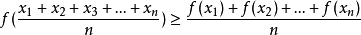
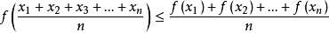
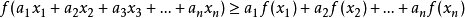

# 信息
i(x) = -log(p(x))
即事件x不确定性的度量，p(x)概率越小，则不确定性越大，信息量越大
log底为2时单位是binary unit简称bit
log底为e时单位是nature unit简称nat
log底为10时单位是hart unit简称hartley

# 熵(信息熵)Entropy
平均信息量即自信息的信息量的数学期望，也叫无条件熵，香农熵，信息熵
期望为自信息发生概率与该信息的信息量的乘积求和
即(i=1,n)求和-p(xi)log(p(xi))
表征了总体的不确定的度
当p(x)=0时认为熵为0
等概率情况越多随机变量越多则随机性越大，即熵的极值

# 可加性
当随机变量取值不是通过一次实验而是若干次实验确定取值时，X在各次实验中不确定性可加，其和始终与通过一次实验取得的结果不确定程度相同

# 获得信息量
实验前熵-试验后熵即获得的信息量
实验前熵一般认为是各个随机变量等概论情况
试验后即做完实验发现概率的熵

# 二元熵
对0-1分布变量所求熵
H(x) = -plog(p) - (1-p)log(1-p)

# 条件熵
H(X|Y) = -p(x,y)log(p(x|y))
其中求期望时概率为联合分布概率而非条件概率。在求信息时用的时条件概率
意义是：已知一随机变量情况下对另一随机变量不确定性的度量

# 联合熵
H(XY) = -p(x,y)log(p(x,y))
意义是：二元随机变量的不确定性度量

# 联合熵与条件熵
H(Y|X)=H(X,Y)−H(X)
H(X|Y)=H(X,Y)−H(Y)

当X，Y独立时有H(X,Y)=0
即有H(X|Y)=H(Y)
H(Y|X)=H(X)
条件熵总是小于等于无条件熵

# Jensen不等式
当为凸函数时有

当为凹函数时有

上述都在x1=x2=..xn时等号成立
加权形式：a1+a2+...an=1

# 相对熵
也叫KL散度
设p(x),q(x)是离散变量X集合的两个不同的概率分布，则p对q的相对熵是log(p(x)/q(x))在概率p(x)下的加权期望
Dkl(p||q) = 求和p(x)*log(p(x)/q(x))
若分布相同则KL散度为0
Dkl(p||q) ！= Dkl(q||p)
Dkl(p||q)>=0

# 交叉熵
H(p,q) = -p(x)*log(q(x))
有KL散度的关系：Dkl(p||q)=H(p,q)-H(p)
在机器学习中训练数据分布是固定的，即H(p)为常量，所以最小化KL散度的过程就是最小化交叉熵的过程
而训练的过程就是为了让模型分布满足真实分布，但由于不知道真实分布就利用训练集分布代替，而分布的差异利用KL散度衡量，故当训练数据分布不变时，交叉熵可以作为衡量数据分布差异的标准。

# 互信息
定义为I(x;y) = H(x)-H(x|y)
I(x;y) = H(x)+H(y)-H(x,y)
即x的自信息量-y条件下x的信息量，差值为y变量能够提供关于变量x的平均信息量
当x可以唯一确定y时有H(y|x)=0 故I(x;y)=H(y)
