# 凸性
若曲线上任意两点连成直线，此直线上任一点都在曲线包围的区域内，则曲线具有凸性。而凸优化的凸是开口向上的也就是二阶导必须都大于0，也就是平常的凹才是凸，y=x^2就是凸函数，当求解凹函数时需要加上负号就变成凸函数，再求解

# 凸优化条件
## 1.凸集：
现有曲线上方的所有点集定义为X集合。对于任意给定的x,y属于X集合，总有lamda×x+(1-lamda)×y属于X集合，即X集合中的任意两个元素之间的直线段都属于X集合。
凸集的交集还是凸集。
## 2.凸函数：
f(lamda×x+(1-lamda)×y)<=lamda×f(x)+(1-lamda)×f(y)，即二阶导数大于0
图像如：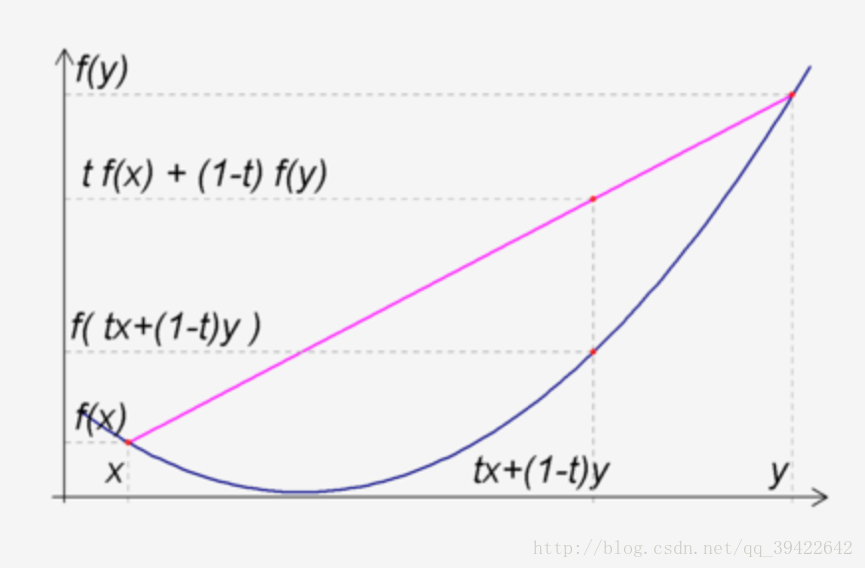

# 凸函数的等价判别方法
## 一阶导数近似判定凸函数：
设函数为一阶可导函数，且定义域为凸集对于任意x,y有：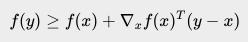
其物理意义是用x点的切平面近似f(y)，但如果是凸函数，则利用切平面近似的点一定在函数真值的下方。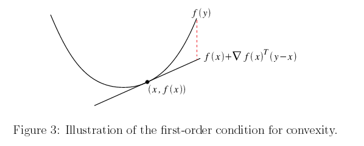
## Jacobi矩阵
一个从欧式n维空间转换到欧式m维空间的函数。这个函数由m个实函数组成: y1(x1,...,xn), ..., ym(x1,...,xn). 这些函数的偏导数(如果存在)可以组成一个m行n列的矩阵，这就是所谓的雅可比矩阵：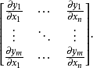
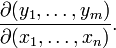
如求y的全微分
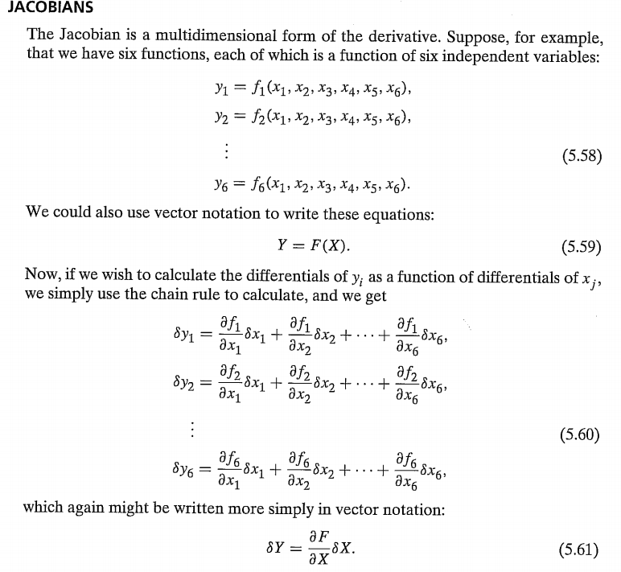
在机器人学中，每一个关节只有一个自由度，多个关节链接从而组成末端执行器的6个自由度。
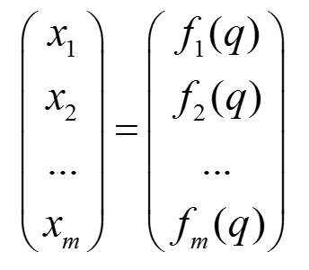
然后对每一个自由度进行全微分得到每个自由度的角速度和线速度！！！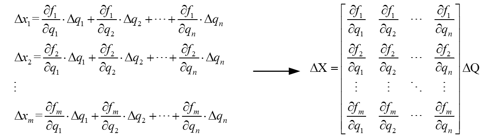
Jocobi矩阵就是可以求n维到m维函数的变量微分
## Hessian矩阵
是一个多元函数的二阶偏导数构成的方阵。
当f(x)在X0处泰勒展开时有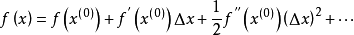
而二元函数f(x1,x2)在X0(x10,x20)处的泰勒展开有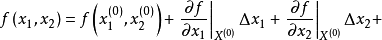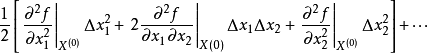
写成矩阵相乘形式：
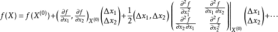
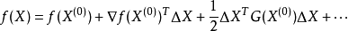
其中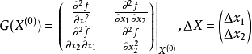
可得到hessian矩阵
Hessian矩阵可以方便的将二元二阶泰勒公式推导到多元泰勒公式
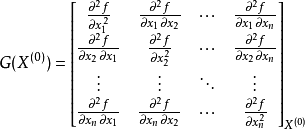
## Hessian矩阵判定函数性质
当二阶导数为0时：
1）当A正定矩阵时是极小值；
2）当A负定矩阵时是极大值；
3）当A不定矩阵时不是极值点。
4）当A为半正定矩阵或半负定矩阵是“可疑”极值点，尚需要利用其他方法来判定。
## 正定矩阵
一个矩阵M对于任意非零向量z都有zT × M × z> 0则矩阵正定
有以下等价条件：
1）A是正定矩阵；
2）**A的一切顺序主子式均为正**；
3）**A的特征值均为正；**
4）存在实可逆矩阵C，使A=C′C；
5）存在秩为n的m×n实矩阵B，使A=B′B；
6）存在主对角线元素全为正的实三角矩阵R，使A=R′R 。
## 二阶导数近似判定凸函数
设函数二阶可导，即Hessian矩阵在定义域上都有定义，当且仅当定义域为凸集且Hessian矩阵是半正定时函数为凸函数，正定时为严格凸函数。
## 凸函数的非负加权和
凸函数的非负加权和还是凸函数
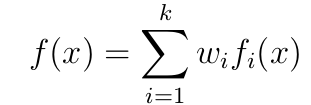

# 局部最优值与全局最优值
当模型曲线是凸函数时，局部最优必然会得到全局最优。故可用迭代的方法求解凸函数问题。

# 梯度下降
梯度下降法的优化思想是用当前位置负梯度方向作为搜索方向，因为该方向为当前位置的最快下降方向，所以也被称为是”最速下降法“。最速下降法越接近目标值，步长越小，前进越慢
且可能会“之字形”地下降：
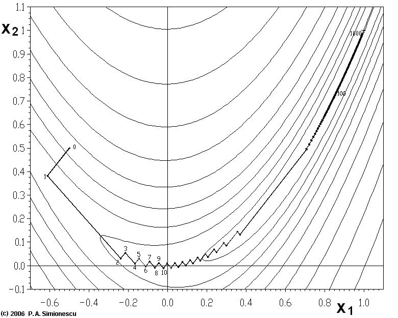

# Newton's method
牛顿法是一种在实数域和复数域上近似求解方程的方法。方法使用函数f (x)的泰勒级数的前面几项来寻找方程f (x) = 0的根。牛顿法最大的特点就在于它的收敛速度很快。
首先，选择一个接近函数 f(x)零点的x0，计算相应的 f(x0) 和切线斜率f'(x0)。然后我们计算穿过点(x0,f(x0)) 并且斜率为f'(x0)的直线和x轴的交点的x坐标，也就是求如下方程的解：
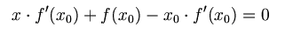
解得：
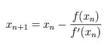
牛顿法目光更加长远，所以少走弯路；相对而言，梯度下降法只考虑了局部的最优，没有全局思想。
**牛顿法问题**：我们现在求解的是f(x)的零点，但实际工程中需要求解极值点即f'(x)的零点，这时就出现了二阶导数。
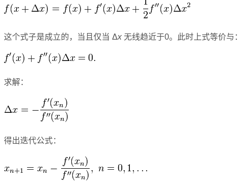
维度高时需要求解Hessian矩阵的逆非常耗时间

# Quasi-Newton Methods
拟牛顿法的本质思想是改善牛顿法每次需要求解复杂的Hessian矩阵的逆矩阵的缺陷，它使用正定矩阵来近似Hessian矩阵的逆，从而简化了运算的复杂度。
拟牛顿法和最速下降法一样只要求每一步迭代时知道目标函数的梯度。通过测量梯度的变化，构造一个目标函数的模型使之足以产生超线性收敛性。这类方法大大优于最速下降法，尤其对于困难的问题。另外，因为拟牛顿法不需要二阶导数的信息，所以有时比牛顿法更为有效。
在牛顿法中有：
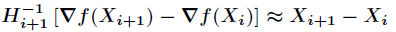
而牛顿法的问题就是求解Hessian矩阵的逆困难，那么可以利用一个矩阵来代替逆Hessian矩阵，并且每次迭代更新这个矩阵就可以了
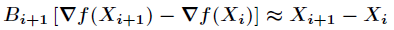
B矩阵就是代替逆Hessian矩阵。
## DFP拟牛顿法
设B矩阵是有迭代而来，则有如下迭代：
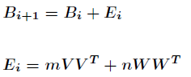
带入方程后得：
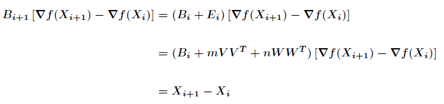
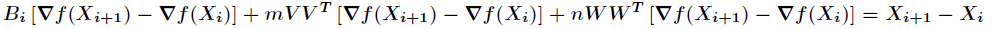
再将符号重新记入
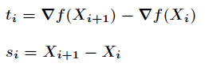
得到
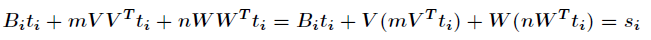
将需要求解的变量移项
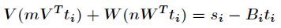
若需要求解的变量有如下则等式成立：
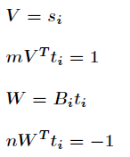
最终带入原始算式得到：
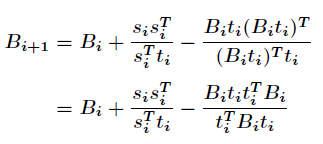
这时就求出了B矩阵的迭代方法而近似了Hessian矩阵的逆

# 单层神经感知机是凸函数
凸函数是相对于参数空间而言的，求解是否是凸函数时，不是对训练集x求解，而是对参数w，b求解。
损失函数为1/2*(T-y)^2
y=k1*x+K2*x+...+b
现在求解K参数是否是凸函数
求解Hessian矩阵
即对K1，K2求二阶偏导
|x1^2 x1*x2|
|x2*x1 x2^2|
观察顺序主子式
x1^2肯定>=0
再看二阶主子式有x1^2 + x2^2 - 2*x1*x2
化简为(x1-x2)^2也>=0
故感知机为凸函数

# 多层神经网络是非凸的
考虑单节点二层神经网络：
y=k1*(k2*x+b2)+b1
求解Hessian矩阵有对k1二阶偏导数(k2*x+b2)^2， k2二阶偏导数k1^2 * x^2。虽然对角线元素>=0但无法证明二阶顺序主子式正定，当然x=0时正定，可不代表x属于R时也正定，故为非凸函数。